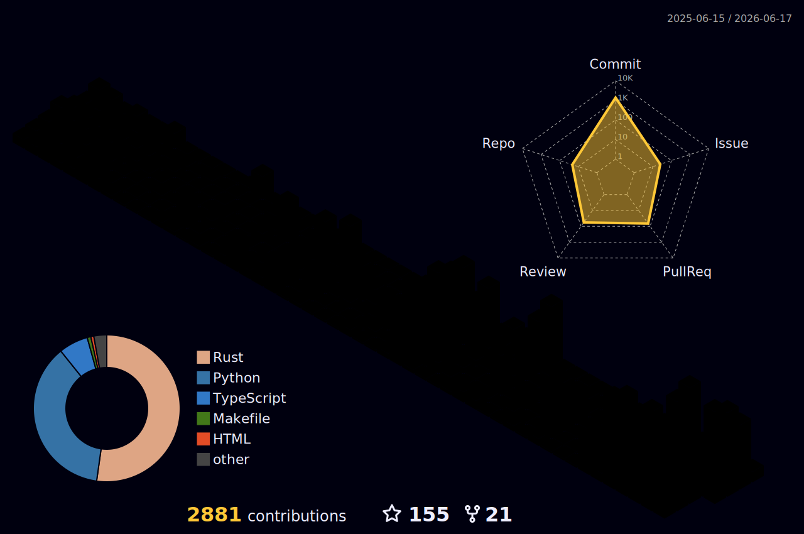

<table style="border-color: transparent;" cellspacing=0 ><tr><td valign="center" width="70%">
  
**Artificial Intelligence** 

There’s going to be something more academic and something that fascinates me. 
I have always had an absurd idea-composing music in a programming language and programming in a music language([~~Maybe we can really try for it~~](https://github.com/AICMUniversity/aria)).

**Music Theories**

I like to write [some tiny songs](https://fm.jyunko.cn). I have a deep understanding of the expressiveness and emotion of music. I also have a peculiar idea, which is to compose music in a programming language and program in a music language. I think this can create a new connection between music and programming, and also allow music and programming enthusiasts to learn and communicate with each other. 

**GPG Keys**  
<i@jyunko.cn>([5DE2131FAD104AEBA3D36BDF519BB8194D892FD0](https://keys.openpgp.org/search?q=5DE2131FAD104AEBA3D36BDF519BB8194D892FD0))  

</td>
</td><td valign="top" width="50%">
<p align="right">

  ***
  
  > 人类对科技，一比零 :s
  
  ***
  


  ***
  
  > Human Vs. AI (1:0) :s
  
  ***
  
</p>
</td>
</tr></table>

<table style="border-color: transparent;" cellspacing=0 ><td valign="top" width="80%">

[](https://wakatime.com/@67d1aacd-464b-4a54-979b-a139888cabf5)

<!--START_SECTION:waka-->
**I'm an Early 🐤** 

```text
🌞 Morning                8394 commits        █████░░░░░░░░░░░░░░░░░░░░   19.42 % 
🌆 Daytime                14686 commits       ████████░░░░░░░░░░░░░░░░░   33.97 % 
🌃 Evening                9902 commits        ██████░░░░░░░░░░░░░░░░░░░   22.90 % 
🌙 Night                  10252 commits       ██████░░░░░░░░░░░░░░░░░░░   23.71 % 
```
📅 **I'm Most Productive on Wednesday** 

```text
Monday                   6204 commits        ████░░░░░░░░░░░░░░░░░░░░░   14.35 % 
Tuesday                  5233 commits        ███░░░░░░░░░░░░░░░░░░░░░░   12.10 % 
Wednesday                8045 commits        █████░░░░░░░░░░░░░░░░░░░░   18.61 % 
Thursday                 5710 commits        ███░░░░░░░░░░░░░░░░░░░░░░   13.21 % 
Friday                   5817 commits        ███░░░░░░░░░░░░░░░░░░░░░░   13.45 % 
Saturday                 4771 commits        ███░░░░░░░░░░░░░░░░░░░░░░   11.04 % 
Sunday                   7454 commits        ████░░░░░░░░░░░░░░░░░░░░░   17.24 % 
```


📊 **This Week I Spent My Time On** 

```text
💬 Programming Languages: 
TypeScript               26 hrs 42 mins      ███████████████░░░░░░░░░░   58.97 % 
CSS                      7 hrs 19 mins       ████░░░░░░░░░░░░░░░░░░░░░   16.19 % 
Other                    5 hrs 16 mins       ███░░░░░░░░░░░░░░░░░░░░░░   11.65 % 
Python                   1 hr 34 mins        █░░░░░░░░░░░░░░░░░░░░░░░░   03.47 % 
Markdown                 1 hr 30 mins        █░░░░░░░░░░░░░░░░░░░░░░░░   03.33 % 

🔥 Editors: 
Neovim                   26 hrs 51 mins      ███████████████░░░░░░░░░░   59.29 % 
VS Code                  12 hrs 4 mins       ███████░░░░░░░░░░░░░░░░░░   26.67 % 
Unknown Editor           6 hrs 4 mins        ███░░░░░░░░░░░░░░░░░░░░░░   13.39 % 
Vim                      17 mins             ░░░░░░░░░░░░░░░░░░░░░░░░░   00.65 % 

💻 Operating System: 
Mac                      30 hrs 59 mins      █████████████████░░░░░░░░   68.40 % 
Linux                    14 hrs 18 mins      ████████░░░░░░░░░░░░░░░░░   31.60 % 
```


 Last Updated on 06/05/2026 18:46:55 UTC
<!--END_SECTION:waka-->

</td>
<td valign="top" width="80%">
  
**Currently**

> Projects & Researchs

<table style="border-color: transparent;" cellspacing=0 >
  <tr>
    <td valign="center" width="50%">
      <a aria-label="PYTHON version" href="https://pypi.org/project/hydro_roll" target="blank"></a> 
    </td>
  </tr>
  <tr>
    <td valign="center" width="50%">
      <a aria-label="PYTHON version" href="https://pypi.org/project/oneroll" target="blank"></a>
    </td>
  </tr>
  <tr>
    <td valign="center" width="50%">
      <a href="https://github.com/HydroRoll-Team/echo/"></a> 
    </td>
  </tr>
</table>

> organizations

<table style="border-color: transparent;" cellspacing=0 >
  <tr>
    <td valign="center" width="50%">
      <i>HydroRoll</i>
      <a href="https://docs.hydroroll.team">[docs]</a>
      <br />
      <a href="https://github.com/HydroRoll-Team"></a>
    </td>
  </tr>
  <tr>
    <td valign="center" width="50%">
      <i>AICMUniversity</i>
      <br />
      <a href="https://anthology.aicmu.ac.cn">[anthology]</a>
      <br />
      <a href="https://github.com/AICMUniversity"></a>
    </td>
  </tr>
  <tr>
    <td valign="center" width="50%">
      <i>AsynthIn</i>
      <a href="https://github.com/AsynthIn/rysyn">[rysyn]</a>
      <br />
      <a href="https://github.com/AsynthIn"></a>
    </td>
  </tr>
  <tr>
    <td valign="center" width="50%">
      <i>Retrofor wut?</i>
      <br />
      <a href="https://iamai.is-a.dev">[iamai:docs]</a>
      <br />
      <a href="https://github.com/retrofor"></a>
    </td>
  </tr>
</table>

</td></table>

<table><tr><td valign="top" width="33%">
  
### Recent releases
<!-- recent_releases starts -->
[swi-prolog-docs nightly](https://github.com/HsiangNianian/swi-prolog-docs/releases/tag/nightly) - 2026-05-06

[iamai v0.2.3](https://github.com/retrofor/iamai/releases/tag/v0.2.3) - 2026-05-06

[DropOut dropout v0.2.0-alpha.6](https://github.com/HydroRoll-Team/DropOut/releases/tag/dropout-v0.2.0-alpha.6) - 2026-03-29

[soon v0.1.9](https://github.com/HsiangNianian/soon/releases/tag/v0.1.9) - 2026-02-24

[hacktyper 🚀 v0.2.7](https://github.com/HsiangNianian/hacktyper/releases/tag/v0.2.7) - 2026-01-13

[online-judge algohub-server v0.1.18](https://github.com/swpu-acm/online-judge/releases/tag/algohub-server-v0.1.18) - 2025-03-26

[GetPlayerCard v0.4.4](https://github.com/HsiangNianian/GetPlayerCard/releases/tag/v0.4.4) - 2025-02-18

[testforchangelog v1.0.0.alpha.3](https://github.com/retrofor/testforchangelog/releases/tag/v1.0.0.alpha.3) - 2024-01-29

[unpredictableFate v3.0.2](https://github.com/HsiangNianian/unpredictableFate/releases/tag/v3.0.2) - 2023-10-19

[flarum-post-formatter v0.0.5✨](https://github.com/HsiangNianian/flarum-post-formatter/releases/tag/v0.0.5) - 2023-05-19
<!-- recent_releases ends -->

_More [recent releases](https://github.com/HsiangNianian/HsiangNianian/blob/main/releases.md)_
</td><td valign="top" width="33%">

### Academic site
<!-- blog starts -->

<!-- blog ends -->

_More on [academic.jyunko.cn](https://academic.jyunko.cn/)_
</td>
<td valign="top" width="25%">
  
</td>
</table>

<p align="right">Welcome to <a href="https://twitter.com/HsiangNianian">follow @HsiangNianian on Twitter<a></p>
