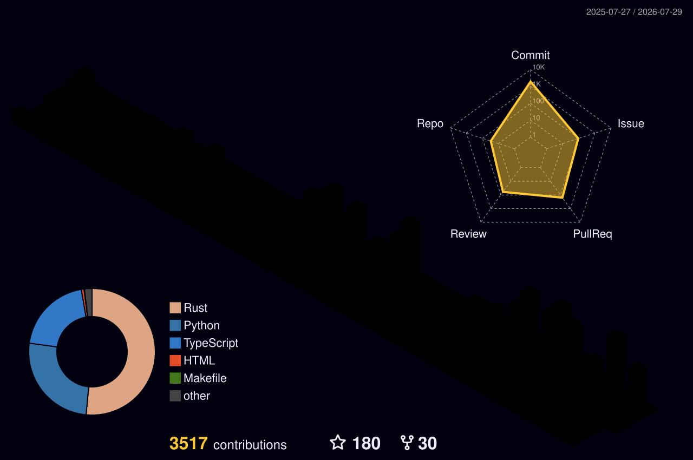

<table style="border-color: transparent;" cellspacing=0 ><tr><td valign="center" width="70%">
  
**Artificial Intelligence** 

There’s going to be something more academic and something that fascinates me. 
I have always had an absurd idea-composing music in a programming language and programming in a music language([~~Maybe we can really try for it~~](https://github.com/AICMUniversity/aria)).

**Music Theories**

I like to write [some tiny songs](https://fm.jyunko.cn). I have a deep understanding of the expressiveness and emotion of music. I also have a peculiar idea, which is to compose music in a programming language and program in a music language. I think this can create a new connection between music and programming, and also allow music and programming enthusiasts to learn and communicate with each other. 

**GPG Keys**  
<i@jyunko.cn>([5DE2131FAD104AEBA3D36BDF519BB8194D892FD0](https://keys.openpgp.org/search?q=5DE2131FAD104AEBA3D36BDF519BB8194D892FD0))  

</td>
</td><td valign="top" width="50%">
<p align="right">

  ***
  
  > 人类对科技，一比零 :s
  
  ***
  


  ***
  
  > Human Vs. AI (1:0) :s
  
  ***
  
</p>
</td>
</tr></table>

<table style="border-color: transparent;" cellspacing=0 ><td valign="top" width="80%">

[](https://wakatime.com/@67d1aacd-464b-4a54-979b-a139888cabf5)
[](https://lcti.hydroroll.team)
[](https://ghfind.com/u/hsiangnianian?ref=badge)

<!--START_SECTION:waka-->


**I'm an Early 🐤** 

```text
🌞 Morning                5005 commits        ██████░░░░░░░░░░░░░░░░░░░   22.65 % 
🌆 Daytime                9053 commits        ██████████░░░░░░░░░░░░░░░   40.97 % 
🌃 Evening                4809 commits        █████░░░░░░░░░░░░░░░░░░░░   21.76 % 
🌙 Night                  3230 commits        ████░░░░░░░░░░░░░░░░░░░░░   14.62 % 
```
📅 **I'm Most Productive on Friday** 

```text
Monday                   2791 commits        ███░░░░░░░░░░░░░░░░░░░░░░   12.63 % 
Tuesday                  3449 commits        ████░░░░░░░░░░░░░░░░░░░░░   15.61 % 
Wednesday                3921 commits        ████░░░░░░░░░░░░░░░░░░░░░   17.74 % 
Thursday                 3380 commits        ████░░░░░░░░░░░░░░░░░░░░░   15.30 % 
Friday                   3937 commits        ████░░░░░░░░░░░░░░░░░░░░░   17.82 % 
Saturday                 1781 commits        ██░░░░░░░░░░░░░░░░░░░░░░░   08.06 % 
Sunday                   2838 commits        ███░░░░░░░░░░░░░░░░░░░░░░   12.84 % 
```


📊 **This Week I Spent My Time On** 

```text
💬 Programming Languages: 
Markdown                 2 hrs 12 mins       ████████████░░░░░░░░░░░░░   47.96 % 
Python                   1 hr 30 mins        ████████░░░░░░░░░░░░░░░░░   32.91 % 
Bash                     30 mins             ███░░░░░░░░░░░░░░░░░░░░░░   11.14 % 
env                      11 mins             █░░░░░░░░░░░░░░░░░░░░░░░░   04.07 % 
TOML                     5 mins              █░░░░░░░░░░░░░░░░░░░░░░░░   02.15 % 

🔥 Editors: 
Neovim                   4 hrs 34 mins       █████████████████████████   99.82 % 
Vim                      0 secs              ░░░░░░░░░░░░░░░░░░░░░░░░░   00.18 % 

💻 Operating System: 
Mac                      4 hrs 35 mins       █████████████████████████   100.00 % 
```

🤖 **AI Coding This Week** 

```text
No AI Coding Activity Tracked This Week
```


 Last Updated on 16/08/2026 18:10:59 UTC
<!--END_SECTION:waka-->

</td>
<td valign="top" width="25%">
  
</td>
<table>


  
<tr><td valign="top" width="33%">
  
### Recent releases
<!-- recent_releases starts -->
[dsh-auto-continue v0.6.0](https://github.com/HsiangNianian/dsh-auto-continue/releases/tag/v0.6.0) - 2026-08-16

[swi-prolog-docs nightly](https://github.com/HsiangNianian/swi-prolog-docs/releases/tag/nightly) - 2026-08-14

[DropOut dropout v0.2.0-rc.1](https://github.com/HydroRoll-Team/DropOut/releases/tag/dropout-v0.2.0-rc.1) - 2026-08-04

[soon v0.5.0](https://github.com/HsiangNianian/soon/releases/tag/v0.5.0) - 2026-07-30

[proof-pr v0.1.1](https://github.com/HsiangNianian/proof-pr/releases/tag/v0.1.1) - 2026-07-18

[iamai v0.3.0](https://github.com/retrofor/iamai/releases/tag/v0.3.0) - 2026-07-15

[GlyphWeave v0.1.0](https://github.com/HsiangNianian/GlyphWeave/releases/tag/v0.1.0) - 2026-07-12

[hacktyper 🚀 v0.2.7](https://github.com/HsiangNianian/hacktyper/releases/tag/v0.2.7) - 2026-01-13

[online-judge algohub-server v0.1.18](https://github.com/swpu-acm/online-judge/releases/tag/algohub-server-v0.1.18) - 2025-03-26

[GetPlayerCard v0.4.4](https://github.com/HsiangNianian/GetPlayerCard/releases/tag/v0.4.4) - 2025-02-18
<!-- recent_releases ends -->

_More [recent releases](https://github.com/HsiangNianian/HsiangNianian/blob/main/releases.md)_
</td><td valign="top" width="33%">

### Academic site
<!-- blog starts -->
<details><summary>2026-02-21 <a href="https://academic.jyunko.cn/2026/02/21/New-Album-Malkuth">New Album: Malkuth</a></summary><p>Info</p></details>

<details><summary>2025-10-08 <a href="https://academic.jyunko.cn/2025/10/08/Maillard-Reaction">Maillard Reaction</a></summary><p>The Maillard reaction, a complex series of chemical reactions between amino acids and reducing sugars, is responsible for the browning and flavor development in cooked foods. This reaction typically occurs at elevated temperatures, such as during frying, baking, or roasting.</p></details>

<details><summary>2025-02-01 <a href="https://academic.jyunko.cn/2025/02/01/Interval-Algebra">Interval Algebra: When Category Theory Reshapes Musical DNA</a></summary><p>While debugging an AI composition system at dawn, I encountered the 42nd "parallel fifth paradox": when optimizing harmonic consonance, the model persistently generated intervals forbidden by classical theory. The monitoring log revealed: ...</p></details>

<details><summary>2024-05-25 <a href="https://academic.jyunko.cn/2024/05/25/Can-KAN-beat-MLPs">Can Kolmogorov–Arnold Networks (KAN) beat MLPs?</a></summary><p>Lately, it seems that the entire AI community has become about one and one thing only, LLMs. They are cool in their own way, but they are not the entire AI field. In all the LLMs and AI agent hype a paper like Kolmogorov–Arnold Networks is a breath of fresh air. This paper seems quite groundbreaking and might completely change the field. Rarely do we see papers challenging the fundamentals of AI, but this one seems to do it.</p></details>

<details><summary>2024-01-19 <a href="https://academic.jyunko.cn/2024/01/19/Empowering-Python-Developers-A-Comprehensive-Exploration-of-Remote-Package-Imports">Empowering Python Developers: A Comprehensive Exploration of Remote Package Imports</a></summary><p>In the expansive world of Python programming, the advent of remote package imports has emerged as a transformative and influential feature. This dynamic capability not only streamlines code management but also unlocks innovative avenues for collaboration and modular development. This blog post aims to delve deep into the significance of remote package imports, unravel the underlying mechanisms, and provide in-depth examples to illustrate their practical applications.</p></details>

<details><summary>2024-01-05 <a href="https://academic.jyunko.cn/2024/01/05/Build-An-Audio-Programming-Language">Build An Audio Programming Language</a></summary><p>aria</p></details>

<details><summary>2023-12-27 <a href="https://academic.jyunko.cn/2023/12/27/Build-A-Script-Language">Build A Script Language</a></summary><p>Poly-paradigm Scripting Interface</p></details>
<!-- blog ends -->

_More on [academic.jyunko.cn](https://academic.jyunko.cn/)_
</td>
</table>

<p align="right">Welcome to <a href="https://twitter.com/HsiangNianian">follow @HsiangNianian on Twitter<a></p>
