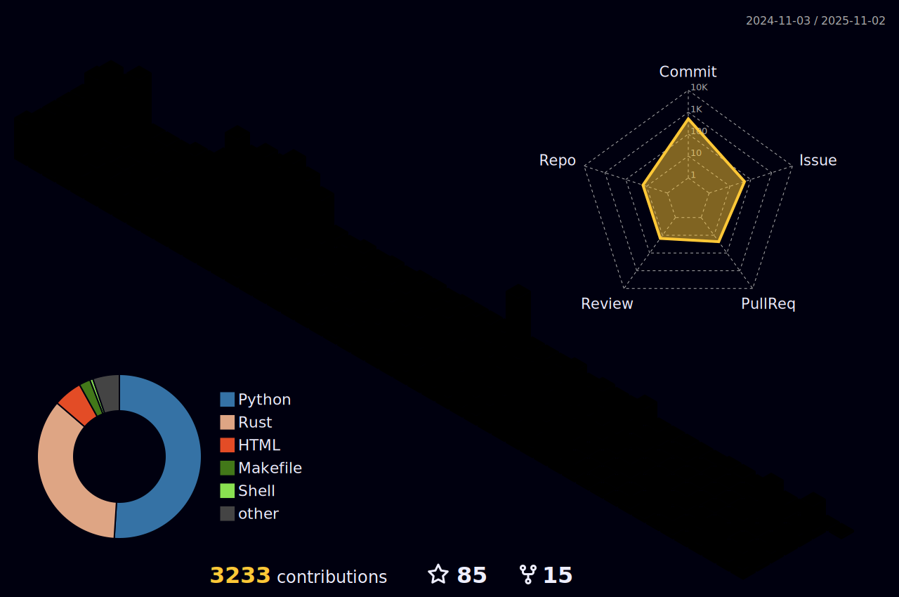

<table style="border-color: transparent;" cellspacing=0 ><tr><td valign="center" width="70%">
  
**Artificial Intelligence** 

There’s going to be something more academic and something that fascinates me. 
I have always had an absurd idea-composing music in a programming language and programming in a music language([~~Maybe we can really try for it~~](https://github.com/AICMUniversity/aria)).

**Music Theories**

I like to write [some tiny songs](https://fm.jyunko.cn). I have a deep understanding of the expressiveness and emotion of music. I also have a peculiar idea, which is to compose music in a programming language and program in a music language. I think this can create a new connection between music and programming, and also allow music and programming enthusiasts to learn and communicate with each other. 

**GPG Keys**  
<i@jyunko.cn>([5DE2131FAD104AEBA3D36BDF519BB8194D892FD0](https://keys.openpgp.org/search?q=5DE2131FAD104AEBA3D36BDF519BB8194D892FD0))  

</td>
</td><td valign="top" width="50%">
<p align="right">

  ***
  
  > 人类对科技，一比零 :s
  
  ***
  


  ***
  
  > Human Vs. AI (1:0) :s
  
  ***
  
</p>
</td>
</tr></table>

<table style="border-color: transparent;" cellspacing=0 ><td valign="top" width="80%">

[](https://wakatime.com/@67d1aacd-464b-4a54-979b-a139888cabf5)

<!--START_SECTION:waka-->
**I'm an Early 🐤** 

```text
🌞 Morning                0 commits           ░░░░░░░░░░░░░░░░░░░░░░░░░   00.00 % 
🌆 Daytime                0 commits           ░░░░░░░░░░░░░░░░░░░░░░░░░   00.00 % 
🌃 Evening                0 commits           ░░░░░░░░░░░░░░░░░░░░░░░░░   00.00 % 
🌙 Night                  0 commits           ░░░░░░░░░░░░░░░░░░░░░░░░░   00.00 % 
```
📅 **I'm Most Productive on Monday** 

```text
Monday                   0 commits           ░░░░░░░░░░░░░░░░░░░░░░░░░   00.00 % 
Tuesday                  0 commits           ░░░░░░░░░░░░░░░░░░░░░░░░░   00.00 % 
Wednesday                0 commits           ░░░░░░░░░░░░░░░░░░░░░░░░░   00.00 % 
Thursday                 0 commits           ░░░░░░░░░░░░░░░░░░░░░░░░░   00.00 % 
Friday                   0 commits           ░░░░░░░░░░░░░░░░░░░░░░░░░   00.00 % 
Saturday                 0 commits           ░░░░░░░░░░░░░░░░░░░░░░░░░   00.00 % 
Sunday                   0 commits           ░░░░░░░░░░░░░░░░░░░░░░░░░   00.00 % 
```


📊 **This Week I Spent My Time On** 

```text
💬 Programming Languages: 
Rust                     6 hrs 16 mins       ██████░░░░░░░░░░░░░░░░░░░   25.31 % 
YAML                     5 hrs 2 mins        █████░░░░░░░░░░░░░░░░░░░░   20.29 % 
Python                   3 hrs 52 mins       ████░░░░░░░░░░░░░░░░░░░░░   15.62 % 
HTML                     3 hrs 14 mins       ███░░░░░░░░░░░░░░░░░░░░░░   13.06 % 
TOML                     1 hr 32 mins        ██░░░░░░░░░░░░░░░░░░░░░░░   06.23 % 

🔥 Editors: 
VS Code                  13 hrs 15 mins      █████████████░░░░░░░░░░░░   53.40 % 
Cursor                   11 hrs 33 mins      ████████████░░░░░░░░░░░░░   46.59 % 
Discord                  0 secs              ░░░░░░░░░░░░░░░░░░░░░░░░░   00.01 % 

💻 Operating System: 
Linux                    24 hrs 48 mins      █████████████████████████   100.00 % 
```


 Last Updated on 23/01/2026 04:51:11 UTC
<!--END_SECTION:waka-->

</td>
<td valign="top" width="80%">
  
**Currently**

> Projects & Researchs

<table style="border-color: transparent;" cellspacing=0 >
  <tr>
    <td valign="center" width="50%">
      <a aria-label="PYTHON version" href="https://pypi.org/project/hydro_roll" target="blank"></a> 
    </td>
  </tr>
  <tr>
    <td valign="center" width="50%">
      <a aria-label="PYTHON version" href="https://pypi.org/project/oneroll" target="blank"></a>
    </td>
  </tr>
  <tr>
    <td valign="center" width="50%">
      <a href="https://github.com/HydroRoll-Team/echo/"></a> 
    </td>
  </tr>
</table>

> organizations

<table style="border-color: transparent;" cellspacing=0 >
  <tr>
    <td valign="center" width="50%">
      <i>HydroRoll</i>
      <a href="https://docs.hydroroll.team">[docs]</a>
      <br />
      <a href="https://github.com/HydroRoll-Team"></a>
    </td>
  </tr>
  <tr>
    <td valign="center" width="50%">
      <i>AICMUniversity</i>
      <br />
      <a href="https://anthology.aicmu.ac.cn">[anthology]</a>
      <br />
      <a href="https://github.com/AICMUniversity"></a>
    </td>
  </tr>
  <tr>
    <td valign="center" width="50%">
      <i>AsynthIn</i>
      <a href="https://github.com/AsynthIn/rysyn">[rysyn]</a>
      <br />
      <a href="https://github.com/AsynthIn"></a>
    </td>
  </tr>
  <tr>
    <td valign="center" width="50%">
      <i>Retrofor wut?</i>
      <br />
      <a href="https://iamai.is-a.dev">[iamai:docs]</a>
      <br />
      <a href="https://github.com/retrofor"></a>
    </td>
  </tr>
</table>

</td></table>

<table><tr><td valign="top" width="33%">
  
### Recent releases
<!-- recent_releases starts -->
[swi-prolog-docs nightly](https://github.com/HsiangNianian/swi-prolog-docs/releases/tag/nightly) - 2026-01-22

[DropOut dropout v0.2.0-alpha.1](https://github.com/HydroRoll-Team/DropOut/releases/tag/dropout-v0.2.0-alpha.1) - 2026-01-18

[hacktyper 🚀 v0.2.7](https://github.com/HsiangNianian/hacktyper/releases/tag/v0.2.7) - 2026-01-13

[iamai v0.2.2](https://github.com/retrofor/iamai/releases/tag/v0.2.2) - 2025-11-04

[online-judge algohub-server v0.1.18](https://github.com/swpu-acm/online-judge/releases/tag/algohub-server-v0.1.18) - 2025-03-26

[GetPlayerCard v0.4.4](https://github.com/HsiangNianian/GetPlayerCard/releases/tag/v0.4.4) - 2025-02-18

[testforchangelog v1.0.0.alpha.3](https://github.com/retrofor/testforchangelog/releases/tag/v1.0.0.alpha.3) - 2024-01-29

[unpredictableFate v3.0.2](https://github.com/HsiangNianian/unpredictableFate/releases/tag/v3.0.2) - 2023-10-19

[flarum-post-formatter v0.0.5✨](https://github.com/HsiangNianian/flarum-post-formatter/releases/tag/v0.0.5) - 2023-05-19

[BlackJack v0.1.0](https://github.com/HsiangNianian/BlackJack/releases/tag/v0.1.0) - 2023-04-21
<!-- recent_releases ends -->

_More [recent releases](https://github.com/HsiangNianian/HsiangNianian/blob/main/releases.md)_
</td><td valign="top" width="33%">

### Academic site
<!-- blog starts -->
<details><summary>2025-10-08 <a href="https://academic.jyunko.cn/2025/10/08/Maillard-Reaction">Maillard Reaction</a></summary><p>The Maillard reaction, a complex series of chemical reactions between amino acids and reducing sugars, is responsible for the browning and flavor development in cooked foods. This reaction typically occurs at elevated temperatures, such as during frying, baking, or roasting.</p></details>

<details><summary>2025-02-01 <a href="https://academic.jyunko.cn/2025/02/01/Interval-Algebra">Interval Algebra: When Category Theory Reshapes Musical DNA</a></summary><p>While debugging an AI composition system at dawn, I encountered the 42nd "parallel fifth paradox": when optimizing harmonic consonance, the model persistently generated intervals forbidden by classical theory. The monitoring log revealed: ...</p></details>

<details><summary>2024-05-25 <a href="https://academic.jyunko.cn/2024/05/25/Can-KAN-beat-MLPs">Can Kolmogorov–Arnold Networks (KAN) beat MLPs?</a></summary><p>Lately, it seems that the entire AI community has become about one and one thing only, LLMs. They are cool in their own way, but they are not the entire AI field. In all the LLMs and AI agent hype a paper like Kolmogorov–Arnold Networks is a breath of fresh air. This paper seems quite groundbreaking and might completely change the field. Rarely do we see papers challenging the fundamentals of AI, but this one seems to do it.</p></details>

<details><summary>2024-01-19 <a href="https://academic.jyunko.cn/2024/01/19/Empowering-Python-Developers-A-Comprehensive-Exploration-of-Remote-Package-Imports">Empowering Python Developers: A Comprehensive Exploration of Remote Package Imports</a></summary><p>In the expansive world of Python programming, the advent of remote package imports has emerged as a transformative and influential feature. This dynamic capability not only streamlines code management but also unlocks innovative avenues for collaboration and modular development. This blog post aims to delve deep into the significance of remote package imports, unravel the underlying mechanisms, and provide in-depth examples to illustrate their practical applications.</p></details>

<details><summary>2024-01-05 <a href="https://academic.jyunko.cn/2024/01/05/Build-An-Audio-Programming-Language">Build An Audio Programming Language</a></summary><p>aria</p></details>

<details><summary>2023-12-27 <a href="https://academic.jyunko.cn/2023/12/27/Build-A-Script-Language">Build A Script Language</a></summary><p>Poly-paradigm Scripting Interface</p></details>

<details><summary>2023-06-12 <a href="https://academic.jyunko.cn/2023/06/12/Reading-Attention-Is-All-You-Need">Reading “Attention Is All You Need”</a></summary><p>The dominant sequence transduction models are based on complex recurrent or convolutional neural networks that include an encoder and a decoder.</p></details>
<!-- blog ends -->

_More on [academic.jyunko.cn](https://academic.jyunko.cn/)_
</td>
<td valign="top" width="25%">
  
</td>
</table>

<p align="right">Welcome to <a href="https://twitter.com/HsiangNianian">follow @HsiangNianian on Twitter<a></p>
